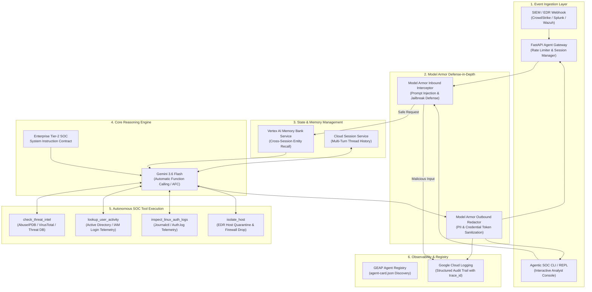
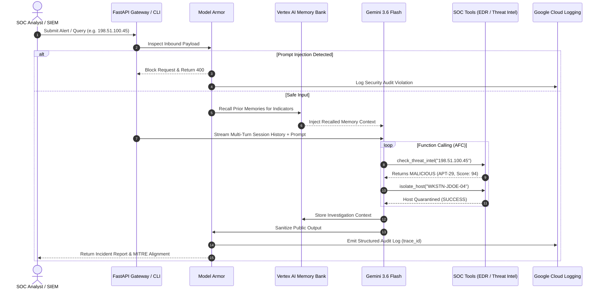

# 🏛️ Secure SOC Analyst Orchestrator — System Architecture

**Track:** The Fortified Enterprise Fleet  
**Platform:** Gemini Enterprise Agent Platform (GEAP)  
**Core Model:** `gemini-3.6-flash` (Vertex AI / Google GenAI SDK)  
**Deployment Target:** Google Cloud Run (Serverless Container)

---

## 1. High-Level Architecture Topology

---

## 2. Component Breakdown

### A. Ingestion & Gateway Layer (`src/gateway/`)
* **`server.py`**: FastAPI application exposing REST and webhook interfaces.
  * `POST /api/v1/webhook/alert`: Ingests raw alerts from SIEM/EDR systems.
  * `POST /api/v1/agent/query`: Interactive endpoint for analysts with session persistence.
  * `GET /api/v1/agent/registry`: Implements A2A (Agent-to-Agent) discovery catalog.
  * `GET /healthz`: Health and readiness probe for Cloud Run.
* **Rate Limiting**: In-memory sliding window rate limiter (120 req/min) mitigating DoS attacks.

### B. Security & Guardrails Layer (`src/security/`)
* **`model_armor.py`**: Defense-in-depth security layer.
  * **Inbound Inspection**: Regex & heuristic multi-turn pattern analysis blocking prompt injection, instruction override, system leaks, and role evasion before hitting the LLM.
  * **Outbound Sanitization**: Zero-leakage redactor neutralizing API keys, Bearer tokens, passwords, and corporate email addresses (`[REDACTED_EMAIL]`, `[REDACTED_API_KEY]`).

### C. Agent Reasoning Engine (`src/agent/`)
* **`soc_agent.py`**: The core orchestrator managing the full pipeline lifecycle:
  1. **Inbound Guardrail Validation**
  2. **Memory Bank Recall** (prior indicators)
  3. **Multi-Turn Context Loading** (session history)
  4. **Gemini Automatic Function Calling Loop**
  5. **Auto-Persist Investigation State**
  6. **Outbound Data Sanitization**
  * **Dual Client Engine**: Seamlessly executes via Vertex AI in GCP or direct Google GenAI SDK with API key.

### D. SOC Tool Suite (`src/tools/`)
* **`soc_tools.py`**: Python functions registered as OpenAPI tools for Gemini:
  * `check_threat_intel(indicator: str)`: Correlates IP reputation, threat score (0-100), threat actor attribution (e.g. APT-29), and associated CVEs.
  * `lookup_user_activity(user_identifier: str)`: Queries Active Directory / IAM logs for geo-anomalies and failed logins.
  * `inspect_linux_auth_logs(ip_address: str)`: Scans live SSH / PAM authentication logs for brute-force patterns.
  * `isolate_host(host_id: str, reason: str)`: Executes active host quarantine or firewall drop rules (`netsh` / `iptables` / `ufw`).

### E. Memory & State Persistence (`src/memory/`)
* **`memory_service.py`**: Implements `VertexAiMemoryBankService` for cross-session knowledge retention. Allows the agent to recall prior malicious investigations even across new sessions.
* **`session_service.py`**: Implements `VertexAiSessionService` maintaining short-term multi-turn conversation threads.

### F. Observability & Agent Registry (`src/observability/`, `src/registry/`)
* **`logger.py`**: Emits JSON logs compatible with Google Cloud Logging. Every step binds a cryptographically unique `trace_id` for compliance audits.
* **`agent-card.json`**: Standard A2A agent card advertising skills, input/output schemas, and least-privilege IAM roles.

---

## 3. End-to-End Execution Sequence

---

## 4. Planning an Agentic CLI Tool: Integration Blueprint

When designing a dedicated **Agentic CLI Tool** for this architecture:

### Architecture Integration Options for the CLI:
1. **Direct Agent Integration (Local Python Library)**:
   * Import `soc_agent` directly from `src.agent.soc_agent`.
   * Fast, zero-network overhead for local terminal operations.
2. **Cloud Run Gateway Client (Remote REST / SSE)**:
   * Connect over HTTPS to the deployed Cloud Run gateway endpoint (or `http://localhost:8080`).
   * Sends queries to `/api/v1/agent/query` and receives structured JSON responses with `actions_taken` and `trace_id`.

### Recommended CLI Capabilities & Commands:
| CLI Command / Mode | Backend Component | Description |
| :--- | :--- | :--- |
| `soc chat` | `soc_agent.process_alert_or_query` | Interactive real-time REPL with Gemini & live tool execution chips. |
| `soc triage <alert_json>` | `POST /api/v1/webhook/alert` | Ingest and immediately triage a raw SIEM alert. |
| `soc memory <indicator>` | `memory_bank.recall_memories` | Inspect recalled enterprise memories for a specific IP/user. |
| `soc isolate <host_id>` | `soc_tools.isolate_host` | Directly trigger emergency EDR host or IP quarantine. |
| `soc audit <trace_id>` | `src/observability/` | Query structured Cloud Logging events for an investigation trace. |
| `soc redteam` | `scripts/advanced_soc_evaluation.py` | Run the automated adversarial jailbreak test battery. |
