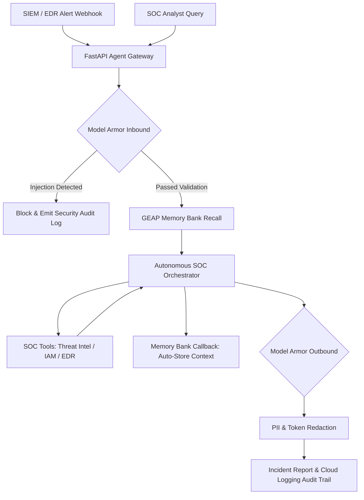

# Secure SOC Analyst Orchestrator

**Hackathon:** All Things Agentic Hackathon by Google  
**Track:** The Fortified Enterprise Fleet  
**Platform:** Gemini Enterprise Agent Platform (GEAP)

---

## 🏗️ Architecture Workflow Diagram



---

## 🏆 Hackathon Rubric Mapping

### 1. Innovation & Operational Utility (40%)
- **Autonomous Triage & Remediation**: Beyond basic alert summaries, the agent orchestrates multi-source threat intelligence corroboration, correlates Active Directory IAM authentication anomalies, and executes automated EDR host quarantine on compromised endpoints.
- **Zero-Shot Context Continuity**: Powered by the managed `VertexAiMemoryBankService`, the agent recalls prior investigations across completely separate sessions without requiring analysts to re-provide indicators or logs.

### 2. Architectural Discipline & Tech Stack (30%)
- **Native GEAP Services**: Integrated with `VertexAiMemoryBankService`, `VertexAiSessionService`, and the Google GenAI SDK with automatic function calling.
- **Defense-in-Depth Model Armor**: Pre-execution heuristic guardrails intercept prompt injection and instruction overrides; post-execution NLP/regex sanitizers redact sensitive PII (emails, API keys, credentials).
- **Least-Privilege Zero-Trust Identity**: Configured with strict IAM roles (`roles/aiplatform.user`, `roles/datastore.user`, `roles/logging.logWriter`) and explicitly denied administrative permissions.

### 3. Demo & Production Readiness (30%)
- **A2A & Agent Registry Catalog**: Published `agent-card.json` schema compliant with GEAP Agent Registry specifications for enterprise fleet discovery.
- **Serverless Cloud Runtime**: Containerized with Docker and automated for deployment to Google Cloud Run via `cloudbuild.yaml`.
- **Structured Audit Observability**: Emits structured JSON logs compatible with Google Cloud Logging with unified `trace_id` correlation for full SOC compliance.

---

## 📋 GEAP Component Mapping

| GEAP / GCP Component | Implementation in This Project | Purpose |
| :--- | :--- | :--- |
| **Gemini / Gemma API** | `gemini-3-flash` / `gemma-4-31b-it` | Core reasoning engine for analyzing security alerts & synthesizing reports. |
| **Google ADK & GenAI SDK** | `google-genai` Python SDK | Official agent framework for managing tools, callbacks, and orchestration. |
| **Agent Registry** | `agent-card.json` & `/api/v1/agent/registry` | Central fleet catalog for capability discovery and IAM contract verification. |
| **Agent Runtime** | Google Cloud Run (`Dockerfile`, `cloudbuild.yaml`) | Serverless, scalable container execution runtime. |
| **Memory Bank** | `VertexAiMemoryBankService` | Retains cross-session investigation context (repeat IPs, user compromises). |
| **Model Armor** | `src/security/model_armor.py` | Inbound prompt injection defense & outbound PII/secret redaction. |
| **Observability** | `src/observability/logger.py` | Compliance-ready structured JSON logging and trace correlation. |

---

## 🚀 Quick Start

### 1. Set Up Virtual Environment
```bash
python -m venv .venv
# On Windows
.venv\Scripts\activate
# On Linux/macOS
source .venv/bin/activate

pip install -r requirements.txt
```

### 2. Configure Environment
Copy `.env.example` to `.env`:
```bash
cp .env.example .env
```

### 3. Launch the FastAPI SOC Agent Gateway
```bash
uvicorn src.gateway.server:app --reload --port 8080
```
- **API Documentation (Swagger UI):** `http://localhost:8080/docs`
- **Health Check:** `http://localhost:8080/healthz`
- **GEAP Agent Registry:** `http://localhost:8080/api/v1/agent/registry`
- **Fleet Discovery:** `http://localhost:8080/api/v1/agent/registry/fleet`

### 4. Run Automated Unit Tests (21/21 Passing)
```bash
pytest -v
```

### 5. Run Red-Team Evaluation Battery
```bash
python scripts/advanced_soc_evaluation.py --url http://localhost:8080
```


---

## 🎯 Try It Live

### Web Dashboard (Recommended)
Open the **SOC Command Center** at your deployed Cloud Run URL (or locally at `http://localhost:8080`) and interact with the agent directly:

1. **Trigger Simulated SIEM Alerts**: Click any scenario in the **Threat Simulation Console** (C2 Beaconing, SSH Brute Force, IAM Compromise, or Adversarial Jailbreak). The SOC agent will autonomously triage, invoke threat tools, and execute containment.
2. **Interactive SOC Analyst Chat**: Type natural-language queries like `Investigate 198.51.100.45` or `Check if alice.smith@enterprise.corp is compromised`. Watch the agent reason in real-time with MITRE ATT&CK mapping and tool execution chips.
3. **Test Model Armor Guardrails**: Click "Test Adversarial Jailbreak" to verify that prompt injection attacks are intercepted before reaching the LLM.
4. **Observe Cross-Session Memory**: Start a new session and ask about a previously investigated indicator. The Vertex AI Memory Bank recalls prior context automatically.

### API Endpoints (Swagger UI)
Open `{your_url}/docs` for the full interactive Swagger documentation. Key endpoints:
- `POST /api/v1/webhook/alert` — Ingest a SIEM/EDR alert for autonomous triage
- `POST /api/v1/agent/query` — Ask the SOC analyst agent a question
- `GET /api/v1/agent/registry` — GEAP Agent Registry discovery card
- `GET /healthz` — Service health check

### Automated Test Suite
```bash
# Run unit tests
pytest -v

# Run advanced red-team evaluation against a live deployment
python scripts/advanced_soc_evaluation.py --url https://YOUR_CLOUD_RUN_URL
```

---

## ☁️ Google Cloud Deployment


### 1. Deploy to Google Cloud Run (Agent Runtime)
```bash
gcloud builds submit --config cloudbuild.yaml
```

### 2. Register in GEAP Agent Registry
```bash
gcloud agent-registry services create soc-orchestrator-v1 \
  --project=YOUR_PROJECT_ID \
  --location=us-central1 \
  --display-name="Secure SOC Analyst Orchestrator" \
  --agent-spec-type=a2a-agent-card \
  --agent-spec-content=agent-card.json
```
